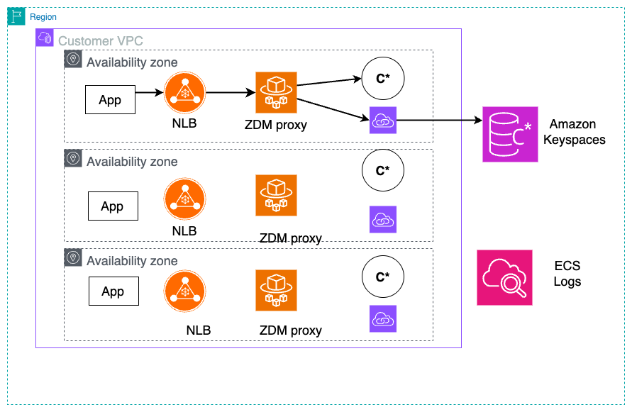

# 🚀 ZDM Dual Write Proxy for Amazon Keyspaces Migration

This project extends the official [ ZDM Proxy](https://github.com/datastax/zdm-proxy) to support seamless **zero-downtime migration** from **Apache Cassandra** to **Amazon Keyspaces (for Apache Cassandra)** with AWS best practices. 

The ZDM Proxy features:
- Used to perform online migration from one Cassandra cluster to another.
- Can perform dual writes without refactoring existing applications
- Perform perform dual reads for query validation

This repository introduces key enhancements for use with Amazon Web Services and Amazon Keyspaces:

- A custom Docker image hosted in **Amazon ECR** for VPC-accessible deployments.
- A **CloudFormation template** to deploy the proxy on **AWS Fargate**, ensuring a scalable, serverless, and secure setup within your existing AWS infrastructure.
- customization to support keyspaces system tables. 


The proxy is deployed with Amazon ECS on Fargate which can scale up and down based on application demand. The Network load balancer allows application traffic to be distributed across a number of ECS tasks. 




## 📁 Project Structure

| File                            | Description                                                                                                                  |
| ------------------------------- | ---------------------------------------------------------------------------------------------------------------------------- |
| `Dockerfile`                    | Builds the custom ZDM Proxy image with Keyspaces-compatible networking and TLS support.                                      |
| `entrypoint.sh`                 | Entry script for the container. Resolves DNS, manages proxy routing via `socat`, and sets environment variables dynamically. |
| `move-docker-to-ecr.sh`         | Automates Docker image build, tagging, and pushing to Amazon ECR. Also downloads the required TLS root cert.                 |
| `zdm-proxy-cloudformation.yaml` | CloudFormation template for deploying the proxy as a Fargate task behind an NLB in a private VPC.                            |

---

## 🛠️ Parameters (CloudFormation Template)

### 🔌 Network Configuration

- **VPCId**: ID of your target VPC.
- **PrivateSubnetIds**: List of private subnet IDs.
- **SecurityGroupId**: Security Group for the Network Load Balancer, and the ECS cluster.
- **RouteTableId**: Used for S3 gateway. 

### 🔄 Origin & Target Cassandra Config

- **ZDMOriginContactPoints**, **ZDMTargetContactPoints**: IP/DNS for the clusters.
- **ZDMOriginPort**, **ZDMTargetPort**: Usually 9042 for Cassandra, always 9142 for Amazon Keyspaces.
- **ZDMOriginUsername/Password**, **ZDMTargetUsername/Password**: Auth credentials. For Keyspaces see [Create service-specific credentials](https://docs.aws.amazon.com/keyspaces/latest/devguide/programmatic.credentials.ssc.html)

### ⚙️ Proxy Config

- **ServiceReplicaCount**: Number of ECS tasks to launch. 3 is a good start
- **ZDMProxyPort**: Port for the proxy service and networkload blancer. Default is `14002`. Do not use 9142. 

---

## 📦 Deployment Instructions

### 1. 🧱 Build and Push Image to Amazon Elastic Container Registery

The following will download zdmproxy image, apply the best practices for Amazon Keyspaces captured in this projects [Dockerfile](DockerFile)
```bash
./move-docker-to-ecr.sh
```

### 2. ☁️ Launch CloudFormation Stack

Upload the `zdm-proxy-cloudformation.yaml` to S3 or the AWS Console and deploy it. Provide required parameters (e.g., subnets, contact points).

---

## 🔐 Security and TLS

- TLS is handled via Amazon Keyspaces' default requirement. The proxy ensures secure, in-transit communication.
- If using TLS for self managed cassandra, include it in the DockerFile. 

---


## 🧪 Testing & Validation

Once deployed:

- Point your application to the NLB DNS created by the CloudFormation stack.
- Test dual writes by verifying data in both origin and target clusters.

---

## 📚 References

- [Amazon Keyspaces Developer Guide](https://docs.aws.amazon.com/keyspaces/latest/devguide/)
- [Official ZDM Proxy Repo](https://github.com/datastax/zdm-proxy)

