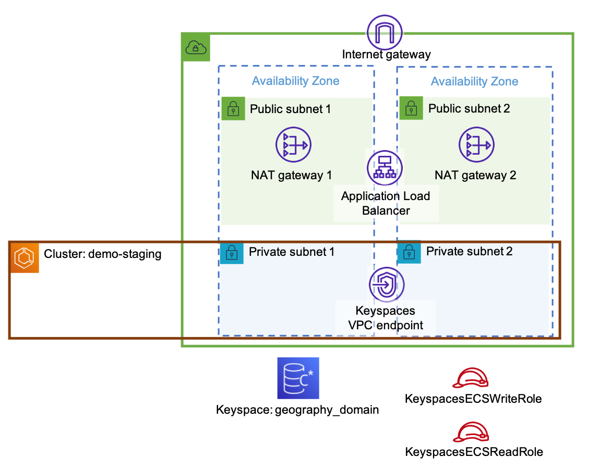

# aws-ecs-keyspaces

This code sample demonstrates how to access Amazon Keyspaces from ECS Tasks running *Node.js* applications. Specifically, it shows how the [Datastax Node.js Cassandra driver](https://docs.datastax.com/en/developer/nodejs-driver/index.html) can be used with the [AWS SIGv4 Authentication Plugin](https://github.com/aws/aws-sigv4-auth-cassandra-nodejs-driver-plugin) to obtain ECS credentials, and to assume permissions as determined by the associated ECS Task role.

## Architecture

The code sample includes a CloudFormation template to build an environment, and two containerised applications *load-data* and *query-api*.

The environment includes a VPC with public and private subnets, an ECS cluster, an application load balancer, an Amazon Keyspaces keyspace, a VPC endpoint for access to Keyspaces, and IAM roles for use with ECS tasks as shown below:



The application architecture is shown below:


The *load-data* application runs a data loading job which can be executed as an ECS task. It creates a table and then inserts some sample data into it. In order to do this, it requires write permissions, which it obtains by specifying a task role that grants write permissions.

The *query-api* application runs a REST API server which can be used to query the data. It is deployed as an ECS service, using the application load balancer to expose the API to the Internet. In order to access the data (using SELECT statements) it requires read permissions, which it obtains through the use of a task role that grants read permissions.

## AWS SIGv4 Authenticator plugin version

The *load-data* application is run as a short-lived task, which loads the data and exits.

The *query-api* server application is a long-lived service. This presents an additonal complication in that the AWS SIGv4 credentials expire after some time, and therefore need to be refreshed periodically.

The credentials refresh is handled automatically by the AWS SDK, but please note this requires use of the correct version of the AWS SIGv4 Authentication Plugin, which must be 1.0.3 or later.

<!--
As of writing, the version published on *npm* is 1.0.2 which does not support this functionality. However the latest version on Github (commit id d4d96a1) does support it. For this reason the `package.json` dependency is specified as follows to retrieve the latest version directly from github:
```
    "aws-sigv4-auth-cassandra-plugin": "https://github.com/aws/aws-sigv4-auth-cassandra-nodejs-driver-plugin.git"
```

Once *npm* is updated to reflect the latest version, this line can be changed to retrieve the plugin from *npm*.
-->

## Walkthrough

### Pre-requsites

To run through this walkthrough, you will need to have the following tools installed:
- [AWS CLI](https://aws.amazon.com/cli/)
- [docker](https://www.docker.com/)
- [curl](https://curl.se/download.html) (usually installed by default on Linux and MacOS)
- cat (standard Linux / MacOS command)

### Step 1: Create environment

Clone the `amazon-keyspace-examples` repo and switch to the
`ecs-sigv4` directory:
```
git clone https://github.com/aws-samples/amazon-keyspaces-examples.git
cd amazon-keyspaces-examples/nodejs/datastax-v4/ecs-sigv4
```

Create the environment stack using:
```
aws cloudformation deploy \
  --stack-name demo-infrastructure \
  --template-file cfn/Environment.yaml \
  --parameter-overrides \
    "EnvironmentName=demo-staging" \
    "KeyspaceName=geography_domain" \
  --capabilities CAPABILITY_IAM
```

This stack includes:

- a VPC with public and private subnets (includes a NAT gateway)
- an ECS cluster (with associated security group and log group)
- an Application Load Balancer for exposing the API server
- NAT Gateways (to enable containers in private subnets to access the Internet)
- a VPC endpoint for accessing Amazon Keyspaces
- a Keyspace
- IAM roles for use with ECS tasks.

Once deployed, extract the following outputs as you will need them to deploy the ECS tasks:

```
aws cloudformation describe-stacks \
  --stack-name demo-infrastructure \
  --query "Stacks[0].Outputs[*].{key:OutputKey,value:OutputValue}" \
  --output text \
| awk '{print "cfn_" $1 "=" $2}' > vars.sh
source vars.sh
export TASK_EXEC_ROLE_ARN=$cfn_TaskExecutionRoleArn
export WRITE_ROLE_ARN=$cfn_KeyspacesECSWriteRoleArn
export READ_ROLE_ARN=$cfn_KeyspacesECSReadRoleArn
export LOG_GROUP=$cfn_ClusterLogGroup
export PRIVATE_SUBNET_ONE=$cfn_PrivateSubnetOne
export PRIVATE_SUBNET_TWO=$cfn_PrivateSubnetTwo
export CONTAINER_SG=$cfn_ContainerSecurityGroup
export EXTERNAL_URL=$cfn_ExternalUrl
export SERVICE_TG=$cfn_ServiceTargetGroup
```

<!--
```
export TASK_EXEC_ROLE_ARN=$(aws cloudformation describe-stacks \
  --stack-name demo-env \
  --query "Stacks[0].Outputs[?OutputKey == 'TaskExecutionRoleArn'].OutputValue" \
  --output text \
)
export WRITE_ROLE_ARN=$(aws cloudformation describe-stacks \
  --stack-name demo-env \
  --query "Stacks[0].Outputs[?OutputKey == 'KeyspacesECSWriteRoleArn'].OutputValue" \
  --output text \
)
export READ_ROLE_ARN=$(aws cloudformation describe-stacks \
  --stack-name demo-env \
  --query "Stacks[0].Outputs[?OutputKey == 'KeyspacesECSReadRoleArn'].OutputValue" \
  --output text \
)
export LOG_GROUP=$(aws cloudformation describe-stacks \
  --stack-name demo-env \
  --query "Stacks[0].Outputs[?OutputKey == 'ClusterLogGroup'].OutputValue" \
  --output text \
)
export PRIVATE_SUBNET_ONE=$(aws cloudformation describe-stacks \
  --stack-name demo-env \
  --query "Stacks[0].Outputs[?OutputKey == 'PrivateSubnetOne'].OutputValue" \
  --output text \
)
export PRIVATE_SUBNET_TWO=$(aws cloudformation describe-stacks \
  --stack-name demo-env \
  --query "Stacks[0].Outputs[?OutputKey == 'PrivateSubnetTwo'].OutputValue" \
  --output text \
)
export CONTAINER_SG=$(aws cloudformation describe-stacks \
  --stack-name demo-env \
  --query "Stacks[0].Outputs[?OutputKey == 'ContainerSecurityGroup'].OutputValue" \
  --output text \
)
export EXTERNAL_URL=$(aws cloudformation describe-stacks \
  --stack-name demo-env \
  --query "Stacks[0].Outputs[?OutputKey == 'ExternalUrl'].OutputValue" \
  --output text \
)
export SERVICE_TG=$(aws cloudformation describe-stacks \
  --stack-name demo-env \
  --query "Stacks[0].Outputs[?OutputKey == 'ServiceTargetGroup'].OutputValue" \
  --output text \
)
```
-->

Also set the following environment variables:
```
export AWS_REGION=$(aws configure get region)
export AWS_ACCOUNT_ID=$(aws sts get-caller-identity --query Account --output text)
```

### Step 2: Run an ECS task to create some data

Log in to ECR:
```
aws ecr get-login-password \
    --region $AWS_REGION \
| docker login \
    --username AWS \
    --password-stdin $AWS_ACCOUNT_ID.dkr.ecr.$AWS_REGION.amazonaws.com
```

Build the application and push to ECR:
```
cd app/load-data
load_data_ecr_uri=$( \
    aws ecr create-repository \
        --repository-name load-data \
        --query repository.repositoryUri \
        --output text \
)
docker build -t load-data:latest .
docker tag load-data:latest $load_data_ecr_uri:latest
docker push $load_data_ecr_uri:latest
```

Register an ECS task definition for *load-data*:
```
cat <<EoF >load-data-taskdef.json
{
  "family": "load-data",
  "cpu": "256",
  "memory": "512",
  "networkMode": "awsvpc",
  "executionRoleArn": "${TASK_EXEC_ROLE_ARN}",
  "taskRoleArn": "${WRITE_ROLE_ARN}",
  "requiresCompatibilities": [
    "FARGATE"
  ],
  "containerDefinitions": [
    {
      "name": "load-data",
      "image": "${AWS_ACCOUNT_ID}.dkr.ecr.${AWS_REGION}.amazonaws.com/load-data",
      "command" : [ "node", "load-data", "-r ${AWS_REGION}", "-k geography_domain", "-t countries"],
      "logConfiguration": {
        "logDriver": "awslogs",
        "options": {
          "awslogs-group": "${LOG_GROUP}",
          "awslogs-region": "${AWS_REGION}",
          "awslogs-stream-prefix": "load-data"
        }
      },
      "essential": true
    }
  ]
}
EoF
aws ecs register-task-definition --cli-input-json file://load-data-taskdef.json
```

Run the job using Fargate:
```
aws ecs run-task \
  --cluster demo-staging \
  --launch-type FARGATE \
  --task-definition load-data \
  --network-configuration "awsvpcConfiguration={subnets=[$PRIVATE_SUBNET_ONE,$PRIVATE_SUBNET_TWO],securityGroups=[$CONTAINER_SG]}"
```

This task creates a table named `countries` in the keyspace `demo`, and populates it with some country data. You can monitor the progress of the task execution in the ECS console. Once the task has completed you can use the Amazon Keyspaces console to verfiy that the table exists, and to query the table.

With the data in place, the next step creates a *query-api* server that makes the data available via a REST API.

### Step 3: Run an ECS service to query data

Build the application and push to ECR:
```
cd ../query-api
query_api_ecr_uri=$( \
    aws ecr create-repository \
        --repository-name query-api \
        --query repository.repositoryUri \
        --output text \
)
docker build -t query-api:latest .
docker tag query-api:latest $query_api_ecr_uri:latest
docker push $query_api_ecr_uri:latest
```

Register an ECS task definition for *query-api*.
```
cat <<EoF >query-api-taskdef.json
{
  "family": "query-api",
  "cpu": "256",
  "memory": "512",
  "networkMode": "awsvpc",
  "executionRoleArn": "${TASK_EXEC_ROLE_ARN}",
  "taskRoleArn": "${READ_ROLE_ARN}",
  "requiresCompatibilities": [
    "FARGATE"
  ],
  "containerDefinitions": [
    {
      "name": "query-api",
      "image": "${AWS_ACCOUNT_ID}.dkr.ecr.${AWS_REGION}.amazonaws.com/query-api",
      "command" : [ "node", "query-api-server", "-r ${AWS_REGION}", "-k geography_domain", "-t countries"],
      "logConfiguration": {
        "logDriver": "awslogs",
        "options": {
          "awslogs-group": "${LOG_GROUP}",
          "awslogs-region": "${AWS_REGION}",
          "awslogs-stream-prefix": "query-api"
        }
      },
      "portMappings": [
        {
          "containerPort": 80,
          "protocol": "tcp"
        }
      ],
      "essential": true
    }
  ]
}
EoF
aws ecs register-task-definition --cli-input-json file://query-api-taskdef.json
```

Run the service using Fargate
```
aws ecs create-service \
  --cluster demo-staging \
  --service-name query-api-server\
  --launch-type FARGATE \
  --task-definition query-api \
  --network-configuration "awsvpcConfiguration={subnets=[$PRIVATE_SUBNET_ONE,$PRIVATE_SUBNET_TWO],securityGroups=[$CONTAINER_SG]}" \
  --desired-count 2 \
  --load-balancers "targetGroupArn=${SERVICE_TG},containerName=query-api,containerPort=80"
```

Wait about 30 seconds for the service to start running and then test as follows.

Test health-check:
```
curl $EXTERNAL_URL/ping
```

Test service end points:
```
curl $EXTERNAL_URL/countries?pretty
curl $EXTERNAL_URL/countries/us?pretty
```

### Stap 4: Clean up

Stop the ECS service
```
aws ecs update-service --cluster demo-staging --service query-api-server --desired-count=0
aws ecs delete-service --cluster demo-staging --service query-api-server
```

Delete the ECR repositories:
```
aws ecr delete-repository --repository-name load-data --force
aws ecr delete-repository --repository-name query-api --force
```

Delete the environment stack:
```
aws cloudformation delete-stack --stack-name demo-infrastructure
```
