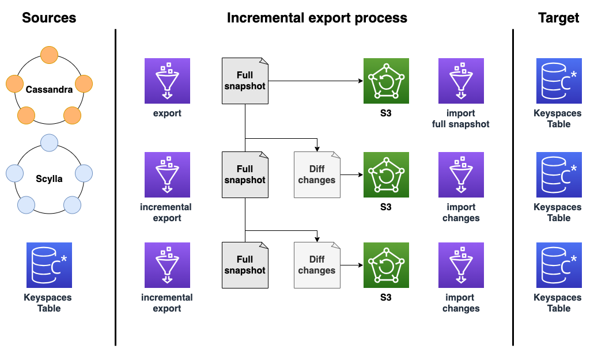

## Using Glue Incremental Export and Import Example
This example provides scala script for creating incremental exports. This can be used to migrate data from Apache Cassandra to Amazon  Keyspaces or create custom backups. Given two exports from different time periods, this script will create a diff consisting of subset consisting of INSERTS, UPDATES, DELETES. By storing the incremental differences one can reduced the overall size of incremental backups.  This example is dependent on previous exports created by [export example](../export-to-s3). This repo leverages diff functionality found in [spark extensions project](https://github.com/G-Research/spark-extension). 




## Update the partitioner for your account
In Apache Cassandra, partitioners control which nodes data is stored on in the cluster. Partitioners create a numeric token using a hashed value of the partition key. Cassandra uses this token to distribute data across nodes.  To use Apache Spark or AWS glue you will need to update the partitioner. You can execute this CQL command from the Amazon Keyspaces console [CQL editor](https://console.aws.amazon.com/keyspaces/home#cql-editor) 

To update the partitioner to the RandomPartitioner, you can use the following query.

```UPDATE system.local set partitioner='org.apache.cassandra.dht.RandomPartitioner' where key='local';```


To see which partitioner is configured for the account, you can use the following query.

```SELECT partitioner from system.local;```

If the partitioner was changed, the query has the following output.

```
partitioner
--------------------------------------------
org.apache.cassandra.dht.RandomPartitioner
```

For more info see [Working with partitioners](https://docs.aws.amazon.com/keyspaces/latest/devguide/working-with-partitioners.html)

## Create IAM ROLE for AWS Glue
Create a new AWS service role named 'GlueKeyspacesExport' with AWS Glue as a trusted entity.

Included is a sample permissions-policy for executing Glue job. You can use managed policies AWSGlueServiceRole, AmazonKeyspacesReadOnlyAccess, read access to S3 bucket containing spack-cassandra-connector jar, configuration. Write access to S3 bucket containing backups.


## Cassandra driver configuration to connect to Amazon Keyspaces
The following configuration for connecting to Amazon Keyspaces with the spark-cassandra connector.

Using the RateLimitingRequestThrottler we can ensure that request do not exceed configured Keyspaces capacity. The G1.X DPU creates one executor per worker. The RateLimitingRequestThrottler in this example is set for 1000 request per second. With this configuration and G.1X DPU you will achieve 1000 request per Glue worker. Adjust the max-requests-per-second accordingly to fit your workload. Increase the number of workers to scale throughput to a table.

```

datastax-java-driver {
  basic.request.default-idempotence = true
  basic.contact-points = [ "cassandra.us-east-1.amazonaws.com:9142"]
  advanced.reconnect-on-init = true

   basic.load-balancing-policy {
        local-datacenter = "us-east-1"
        slow-replica-avoidance = true
     }

   advanced.auth-provider = {
       class = PlainTextAuthProvider
       username = "user-at-sample"
       password = "SAMPLE#PASSWORD"
    }

    advanced.throttler = {
      class = RateLimitingRequestThrottler
      max-requests-per-second = 1000
      max-queue-size = 50000
      drain-interval = 1 millisecond
    }

   advanced.ssl-engine-factory {
      class = DefaultSslEngineFactory
      hostname-validation = false
    }

    advanced.connection.pool.local.size = 3

}

```

## Create S3 bucket to store job artifacts
The AWS Glue ETL job will need to access jar dependencies, driver configuration, and scala script.

```shell script
export ARTIFACT_BUCKET=amazon-keyspaces-artifacts-$(aws sts get-caller-identity --query Account --output text)
export SNAPSHOT_BUCKET=amazon-keyspaces-snapshots-$(aws sts get-caller-identity --query Account --output text)
export SHUFFLE_BUCKET=amazon-keyspaces-shuffle-$(aws sts get-caller-identity --query Account --output text)
```

```
aws s3 mb s3://$SNAPSHOT_BUCKET
```

## Create S3 bucket to store job artifacts
The AWS Glue ETL job will use an s3 bucket to backup keyspaces table data.
```
aws s3 mb s3://$ARTIFACT_BUCKET
```

## Create S3 bucket for Shuffle space
With NoSQL its common to shuffle large sets of data. This can overflow local disk.  With AWS Glue, you can  use Amazon S3 to store Spark shuffle and spill data. This solution disaggregates compute and storage for your Spark jobs, and gives complete elasticity and low-cost shuffle storage, allowing you to run your most shuffle-intensive workloads reliably.

```
aws s3 mb s3://$SHUFFLE_BUCKET
```

## Upload job artifacts to S3
The job will require
* The spark-cassandra-connector to allow reads from Amazon Keyspaces. Amazon Keyspaces recommends version 2.5.2 of the spark-cassandra-connector or above.
* application.conf containing the cassandra driver configuration for Keyspaces access
* export-sample.scala script containing the export code.

```
curl -L -O https://repo1.maven.org/maven2/com/datastax/spark/spark-cassandra-connector-assembly_2.12/3.1.0/spark-cassandra-connector-assembly_2.12-3.1.0.jar

curl -L -O https://repo1.maven.org/maven2/uk/co/gresearch/spark/spark-extension_2.12/2.8.0-3.4/spark-extension_2.12-2.8.0-3.4.jar

aws s3api put-object --bucket $ARTIFACT_BUCKET --key jars/spark-cassandra-connector-assembly_2.12-3.1.0.jar --body spark-cassandra-connector-assembly_2.12-3.1.0.jar

aws s3api put-object --bucket $ARTIFACT_BUCKET --key jars/spark-extension_2.12-2.8.0-3.4.jar --body spark-extension_2.12-2.8.0-3.4.jar

aws s3api put-object --bucket $ARTIFACT_BUCKET --key conf/cassandra-application.conf --body cassandra-application.conf

aws s3api put-object --bucket $ARTIFACT_BUCKET --key scripts/incremental-export-sample.scala --body export-sample.scala

aws s3api put-object --bucket $ARTIFACT_BUCKET --key scripts/incremental-import-sample.scala --body export-sample.scala

```
### Create AWS Glue ETL Job
You can use the following command to create a glue job using the script provided in this example. You can also take the parameters and enter them into the AWS Console.

### Export 
```
aws glue create-job \
    --name "AmazonKeyspacesIncrementalExport" \
    --role "GlueKeyspacesExport" \
    --description "Incremental Export for Amazon Keyspaces" \
    --glue-version "3.0" \
    --number-of-workers 5 \
    --worker-type "G.1X" \
    --command "Name=glueetl,ScriptLocation=s3://amazon-keyspaces-artifacts/scripts/export-sample.scala" \
    --default-arguments '{
        "--job-language":"scala",
        "--FORMAT":"parquet",
        "--KEYSPACE_NAME":"my_keyspace",
        "--TABLE_NAME":"my_table",
        "--S3_URI":"s3://SNAPSHOT_BUCKET/snapshots/",
        "--DRIVER_CONF":"cassandra-application.conf",
        "--DISTINCT_KEYS":"id,create_date",
        "--TODAY_DATE":"2023-08-02", 
        "--YESTERDAY_DATE":"2023-08-02",
        "--user-jars-first":"true",
        "--extra-jars":"s3://$ARTIFACT_BUCKET/jars/spark-cassandra-connector-assembly_2.12-3.1.0.jar,s3://$ARTIFACT_BUCKET/jars/spark-extension_2.12-2.8.0-3.4.jar",
        "--extra-files":"s3://$ARTIFACT_BUCKET/conf/cassandra-application.conf",
        "--enable-continuous-cloudwatch-log":"true",
        "--write-shuffle-files-to-s3":"true",
        "--write-shuffle-spills-to-s3":"true",
        "--TempDir":"s3://$SHUFFLE_BUCKET",
        "--class":"GlueApp"
    }'
```

### Import 

```
aws glue create-job \
    --name "AmazonKeyspacesIncrementalImport" \
    --role "GlueKeyspacesExport" \
    --description "Incremental Import for Amazon Keyspaces" \
    --glue-version "3.0" \
    --number-of-workers 5 \
    --worker-type "G.1X" \
    --command "Name=glueetl,ScriptLocation=s3://amazon-keyspaces-artifacts/scripts/incremental-import-sample.scala" \
    --default-arguments '{
        "--job-language":"scala",
        "--FORMAT":"parquet",
        "--KEYSPACE_NAME":"my_keyspace",
        "--TABLE_NAME":"my_table",
        "--S3_URI":"s3://SNAPSHOT_BUCKET/snapshots/2023-08-02/incremental-snapshot/",
        "--DRIVER_CONF":"cassandra-application.conf",
        "--DISTINCT_KEYS":"id,create_date",
        "--user-jars-first":"true",
        "--extra-jars":"s3://$ARTIFACT_BUCKET/jars/spark-cassandra-connector-assembly_2.12-3.1.0.jar",
        "--extra-files":"s3://$ARTIFACT_BUCKET/conf/cassandra-application.conf",
        "--enable-continuous-cloudwatch-log":"true",
        "--write-shuffle-files-to-s3":"true",
        "--write-shuffle-spills-to-s3":"true",
        "--TempDir":"s3://$SHUFFLE_BUCKET",
        "--class":"GlueApp"
    }'
```