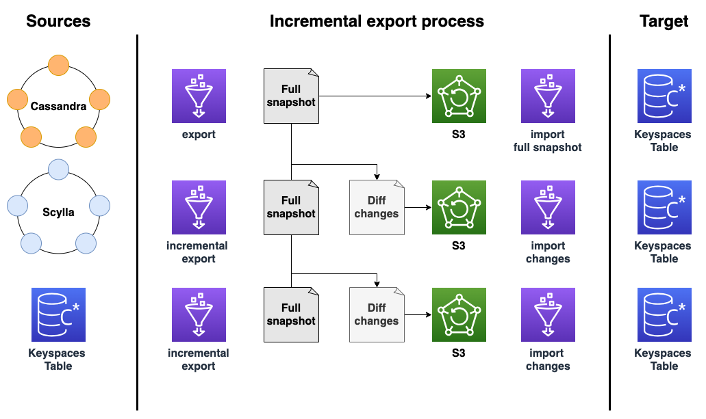

## Incremental Export and Import

This example provides Scala scripts for creating incremental exports by comparing two point-in-time snapshots. Given two exports from different time periods, the script produces a diff consisting of INSERTS, UPDATES, and DELETES. This can be used to migrate data from Apache Cassandra to Amazon Keyspaces or create space-efficient incremental backups.

This example depends on previous exports created by the [export example](../export-to-s3) and leverages diff functionality from the [spark extensions project](https://github.com/G-Research/spark-extension).



### Prerequisites

* Run `./keyspaces-bulk-cli bootstrap` from the [parent directory](../) to set up infrastructure and deploy all Glue jobs
* Two existing snapshots in S3 (created by the export job)

### S3 Output Structure

Incremental diffs are written to:
```
s3://{bucket}/export/{keyspace}/{table}/incremental/year=YYYY/month=MM/day=DD/hour=HH/minute=mm/
```

### Running Incremental Export

```bash
./keyspaces-bulk-cli incremental-export \
  --keyspace mykeyspace \
  --table mytable \
  --past-uri s3://my-bucket/export/mykeyspace/mytable/snapshot/year=2025/month=01/day=01/hour=00/minute=00 \
  --current-uri s3://my-bucket/export/mykeyspace/mytable/snapshot/year=2025/month=01/day=15/hour=00/minute=00 \
  --s3-uri s3://my-bucket \
  --distinct-keys "id,create_date" \
  --format parquet
```

### Running Incremental Import

Apply an incremental diff to a Keyspaces table:

```bash
./keyspaces-bulk-cli incremental-import \
  --keyspace mykeyspace \
  --table mytable \
  --s3-uri s3://my-bucket/export/mykeyspace/mytable/incremental/year=2025/month=01/day=15/hour=12/minute=00 \
  --distinct-keys "id,create_date" \
  --format parquet
```

### Incremental Export Arguments

| Argument | Description | Default |
| :--- | :--- | :--- |
| --KEYSPACE_NAME | Keyspace name | mykeyspace |
| --TABLE_NAME | Table name | mytable |
| --S3_URI | S3 URI root for output | - |
| --PAST_URI | S3 URI of the older snapshot | - |
| --CURRENT_URI | S3 URI of the newer snapshot | - |
| --DISTINCT_KEYS | Comma-separated primary key columns for diff | - |
| --FORMAT | Format: parquet, json, csv | parquet |
| --DRIVER_CONF | Driver configuration file | keyspaces-application.conf |

### Incremental Import Arguments

| Argument | Description | Default |
| :--- | :--- | :--- |
| --KEYSPACE_NAME | Keyspace name | mykeyspace |
| --TABLE_NAME | Table name | mytable |
| --S3_URI | S3 URI of the incremental diff to import | - |
| --DISTINCT_KEYS | Comma-separated primary key columns (used for deletes) | - |
| --FORMAT | Format: parquet, json, csv | parquet |
| --DRIVER_CONF | Driver configuration file | keyspaces-application.conf |

### Diff Format

The output includes a `diff` column indicating the type of change:

| Code | Meaning | Description |
| :--- | :--- | :--- |
| I | INSERT | New row (prefixed with `right_`) |
| D | DELETE | Removed row (prefixed with `left_`) |
| C | CHANGE | Updated row (both `left_` and `right_` values) |
| N | NO CHANGE | Unchanged (filtered out before writing) |

Example output:
```json
{"diff":"I","id":"-67214788834858333A","create_date":"2023-08-01T18:23:59.476Z","right_count":1,"right_data":"-67214788834858333A"}
{"diff":"D","id":"-7134365464711695755","create_date":"2023-02-25T19:08:26.000Z","left_count":-823388298404028328,"left_data":"-7444764033894103459"}
{"diff":"C","id":"-672147888348583332","create_date":"2023-02-27T20:04:30.000Z","left_count":-2365493309516205255,"right_count":1,"left_data":"-1643515377232023460","right_data":"-1643515377232023460"}
```

### Workflow Example

Chain export, incremental export, and incremental import using Glue workflows triggered by EventBridge events (S3 PutObject):

```bash
# 1. Bootstrap
./keyspaces-bulk-cli bootstrap --stack incremental

# 2. First export (creates baseline snapshot)
./keyspaces-bulk-cli export --keyspace mykeyspace --table mytable --s3-uri s3://my-bucket

# 3. Second export (creates new snapshot after data changes)
./keyspaces-bulk-cli export --keyspace mykeyspace --table mytable --s3-uri s3://my-bucket

# 4. Compute diff between the two snapshots
./keyspaces-bulk-cli incremental-export \
  --keyspace mykeyspace --table mytable \
  --past-uri s3://my-bucket/export/mykeyspace/mytable/snapshot/year=2025/month=01/day=01/hour=00/minute=00 \
  --current-uri s3://my-bucket/export/mykeyspace/mytable/snapshot/year=2025/month=01/day=02/hour=00/minute=00 \
  --s3-uri s3://my-bucket \
  --distinct-keys "id,create_date"

# 5. Apply the diff to a target table
./keyspaces-bulk-cli incremental-import \
  --keyspace target_keyspace --table mytable \
  --s3-uri s3://my-bucket/export/mykeyspace/mytable/incremental/year=2025/month=01/day=02/hour=00/minute=30 \
  --distinct-keys "id,create_date"
```
